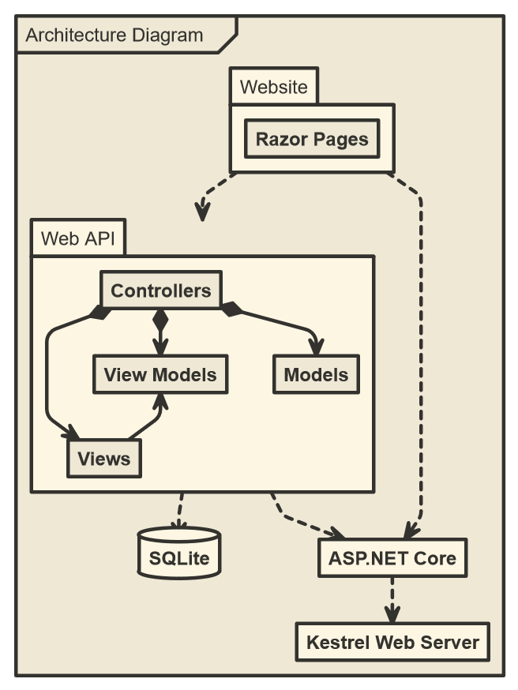

# the-golden-ticket

## About

Wow, what a great ticketing system!

The Golden Ticket system consists of two services:

- GoldenTicket.WebApi
- GoldenTicket.Website

You can build and run both of the services in the same way from within their respective folders.

## Build And Run

If using Visual Studio Code, the built in debugger will take care of building and running for you.

### Required Tools

- [.NET Core SDK](https://www.microsoft.com/net/download/thank-you/dotnet-sdk-2.1.4-windows-x64-installer)

### To Build

1. `dotnet build`

### To Run

1. `dotnet run`

## Architecture

